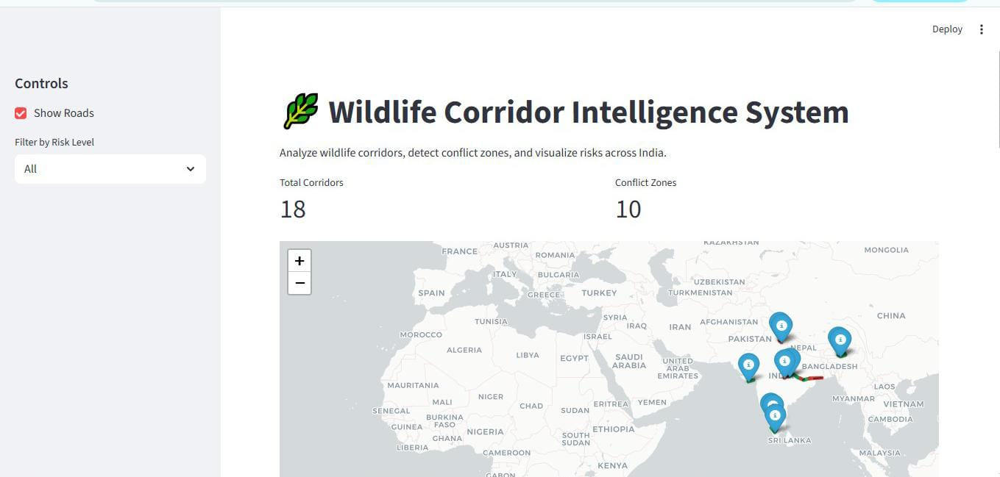
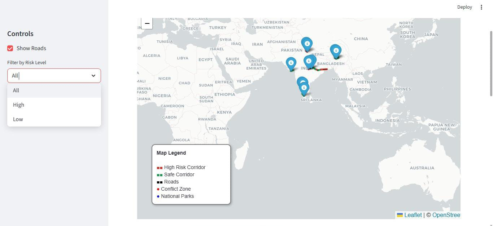

# 🌿 Wildlife Corridor & Infrastructure Analysis


---

## 📌 Overview  
A geospatial analysis project that identifies high-risk conflict zones between wildlife corridors and human infrastructure (roads & railways).  

The system provides an **interactive visualization platform** to support wildlife conservation and safer infrastructure planning.

---

## 📸 Demo  

### 🔹 Application Interface  


### 🔹 Map Visualization  


> 📁 Place your images inside a folder named `images` in your repository.

---

## 🎯 Key Features  
- Detects corridor–infrastructure intersections  
- Identifies and classifies high-risk zones  
- Interactive map visualization using Folium  
- Risk-based filtering system (High / Low)  
- Clean and structured data processing  

---

## 🛠️ Tech Stack  
- **Language:** Python  
- **Libraries:** pandas, geopandas, shapely, folium, streamlit  

---

## 📁 Project Structure
wildlife-corridor-app/ ├── app.py ├── analysis.py ├── utils.py ├── requirements.txt └── images/ ├── output1.png └── output2.png

---

## 🚀 Run Locally  

```bash
pip install -r requirements.txt
streamlit run app.py
Open in browser:
👉 http://localhost:8501⁠�

📊 Use Case
Wildlife conservation planning
Infrastructure risk assessment
Environmental impact analysis

🔮 Future Scope
Real-time wildlife tracking
AI-based risk prediction
Smart corridor optimization

👨‍💻 Author
Satyam Tiwari
B.Tech CSE

⭐ Support
If you found this project useful, consider giving it a ⭐ on GitHub!

---

